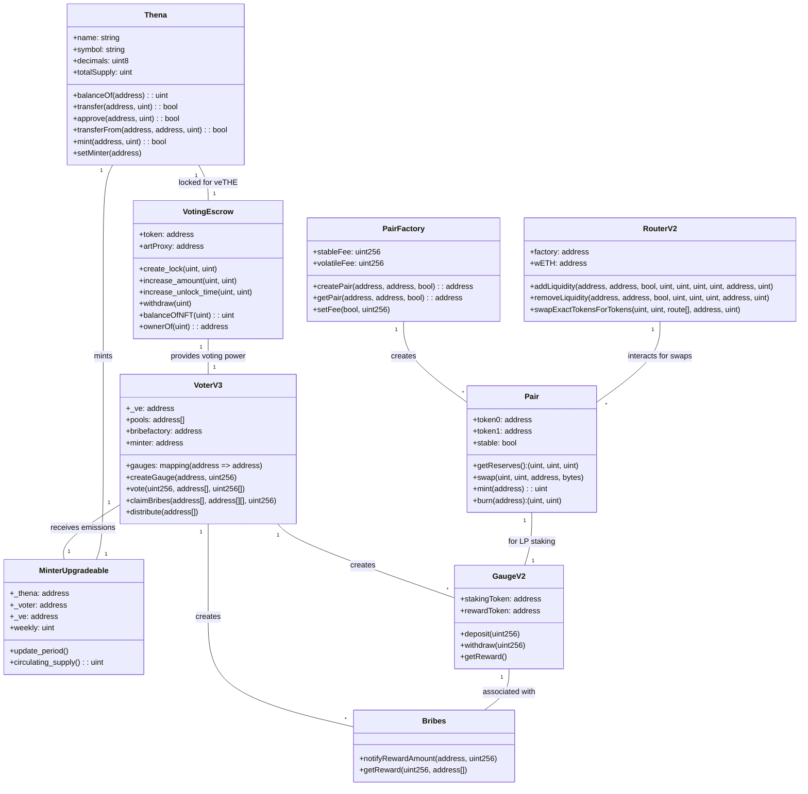

```mermaid
classDiagram
    class Thena {
        +name: string
        +symbol: string
        +decimals: uint8
        +totalSupply: uint
        +balanceOf(address): uint
        +transfer(address, uint): bool
        +approve(address, uint): bool
        +transferFrom(address, address, uint): bool
        +mint(address, uint): bool
        +setMinter(address)
    }

    class VotingEscrow {
        +token: address
        +artProxy: address
        +create_lock(uint, uint)
        +increase_amount(uint, uint)
        +increase_unlock_time(uint, uint)
        +withdraw(uint)
        +balanceOfNFT(uint): uint
        +ownerOf(uint): address
    }

    class VoterV3 {
        +_ve: address
        +pools: address[]
        +gauges: mapping(address => address)
        +bribefactory: address
        +minter: address
        +createGauge(address, uint256)
        +vote(uint256, address[], uint256[])
        +claimBribes(address[], address[][], uint256)
        +distribute(address[])
    }

    class MinterUpgradeable {
        +_thena: address
        +_voter: address
        +_ve: address
        +weekly: uint
        +update_period()
        +circulating_supply(): uint
    }

    class PairFactory {
        +stableFee: uint256
        +volatileFee: uint256
        +createPair(address, address, bool): address
        +getPair(address, address, bool): address
        +setFee(bool, uint256)
    }

    class Pair {
        +token0: address
        +token1: address
        +stable: bool
        +getReserves(): (uint, uint, uint)
        +swap(uint, uint, address, bytes)
        +mint(address): uint
        +burn(address): (uint, uint)
    }

    class RouterV2 {
        +factory: address
        +wETH: address
        +addLiquidity(address, address, bool, uint, uint, uint, uint, address, uint)
        +removeLiquidity(address, address, bool, uint, uint, uint, address, uint)
        +swapExactTokensForTokens(uint, uint, route[], address, uint)
    }

    class GaugeV2 {
        +stakingToken: address
        +rewardToken: address
        +deposit(uint256)
        +withdraw(uint256)
        +getReward()
    }

    class Bribes {
        +notifyRewardAmount(address, uint256)
        +getReward(uint256, address[])
    }

    Thena "1" -- "1" VotingEscrow : locked for veTHE
    VotingEscrow "1" -- "1" VoterV3 : provides voting power
    MinterUpgradeable "1" -- "1" Thena : mints
    VoterV3 "1" -- "1" MinterUpgradeable : receives emissions
    PairFactory "1" -- "*" Pair : creates
    RouterV2 "1" -- "*" Pair : interacts for swaps
    VoterV3 "1" -- "*" GaugeV2 : creates
    VoterV3 "1" -- "*" Bribes : creates
    Pair "1" -- "1" GaugeV2 : for LP staking
    GaugeV2 "1" -- "1" Bribes : associated with
```
