# Thena Protocol Ecosystem Overview

## Comprehensive Ecosystem Diagram

This diagram provides a complete overview of the Thena protocol's architecture and the interactions between its core components.

```mermaid
graph TD
    subgraph "User"
        User_Wallet[User's Wallet: THE, Other Tokens, LP Tokens, veTHE NFT]
    end

    subgraph "AMM (Automated Market Maker)"
        RouterV2
        PairFactory
        Pair_A_B["Pair (Token A/B)"]
        Pair_C_D["Pair (Token C/D)"]
    end

    subgraph "Governance & Staking"
        VotingEscrow["VotingEscrow (veTHE NFT Minter)"]
        VoterV3["VoterV3 (Gauge & Bribe Manager)"]
        Gauge_A_B["Gauge for Pair A/B"]
        Gauge_C_D["Gauge for Pair C/D"]
    end

    subgraph "Tokenomics & Rewards"
        Thena["THE Token"]
        Minter["Minter (Weekly Emissions)"]
        InternalBribe_A_B["Internal Bribe (Trading Fees)"]
        ExternalBribe_A_B["External Bribe (Direct Incentives)"]
    end

    %% -- User Actions --
    User_Wallet -- "1. Swap Tokens" --> RouterV2
    RouterV2 -- "2. Routes Swap" --> Pair_A_B
    Pair_A_B -- "3. Returns Swapped Tokens" --> User_Wallet

    User_Wallet -- "4. Add/Remove Liquidity" --> RouterV2
    RouterV2 -- "5. Mints/Burns LP Tokens from" --> Pair_A_B
    Pair_A_B -- "6. Sends LP Tokens" --> User_Wallet

    User_Wallet -- "7. Deposit THE" --> VotingEscrow
    VotingEscrow -- "8. Mints veTHE NFT" --> User_Wallet

    User_Wallet -- "9. Stake LP Tokens" --> Gauge_A_B
    Gauge_A_B -- "10. Earn THE Rewards" --> User_Wallet
    User_Wallet -- "11. Claim THE" --> Gauge_A_B

    User_Wallet -- "12. Vote on Gauges with veTHE" --> VoterV3
    User_Wallet -- "13. Claim Bribe Rewards" --> InternalBribe_A_B
    User_Wallet -- "14. Claim Bribe Rewards" --> ExternalBribe_A_B

    %% -- Protocol Flows --
    PairFactory -- "Creates" --> Pair_A_B
    PairFactory -- "Creates" --> Pair_C_D

    Minter -- "15. Mints new THE weekly" --> Thena
    VoterV3 -- "16. Receives weekly THE emissions from Minter" --> Minter
    VoterV3 -- "17. Distributes THE based on veTHE votes" --> Gauge_A_B
    VoterV3 -- "17. Distributes THE based on veTHE votes" --> Gauge_C_D

    Pair_A_B -- "18. Generates Trading Fees" --> InternalBribe_A_B

    %% -- Connections --
    VoterV3 -- "Manages" --> Gauge_A_B
    VoterV3 -- "Manages" --> Gauge_C_D
    VoterV3 -- "Creates & Manages" --> InternalBribe_A_B
    VoterV3 -- "Creates & Manages" --> ExternalBribe_A_B
    VotingEscrow -- "Uses" --> Thena
    Minter -- "Distributes to" --> VoterV3

    style User_Wallet fill:#f9f,stroke:#333,stroke-width:2px
    style RouterV2 fill:#bbf,stroke:#333,stroke-width:2px
    style PairFactory fill:#bbf,stroke:#333,stroke-width:2px
    style VotingEscrow fill:#9f9,stroke:#333,stroke-width:2px
    style VoterV3 fill:#9f9,stroke:#333,stroke-width:2px
    style Minter fill:#f96,stroke:#333,stroke-width:2px
    style Thena fill:#f96,stroke:#333,stroke-width:2px
```

## Architecture

The Thena protocol is a decentralized exchange (DEX) with a ve-tokenomics model. The core components of the protocol are:

- **Thena/veTHE:** The native token and its vote-escrowed counterpart.
- **AMM:** Automated market maker with stable and volatile pools.
- **Gauges:** Contracts that distribute `THE` emissions to liquidity providers.
- **Bribes:** A system for rewarding `veTHE` holders for voting for specific gauges.
- **Minter:** A contract that controls the minting of new `THE` tokens.

## Tokenomics

- **`THE`:** The native utility token of the protocol, used for liquidity provision and locking.
- **`veTHE`:** Vote-escrowed `THE`, which gives holders voting power and a share of protocol fees.

## Key Processes

- **Swapping:** Users can swap tokens through the AMM pools, paying a small fee that goes to liquidity providers and `veTHE` holders.
- **Liquidity Provision:** Users can provide liquidity to the AMM pools to earn trading fees and `THE` emissions.
- **Voting:** `veTHE` holders can vote on gauges to direct `THE` emissions to specific pools.
- **Bribing:** Users can offer bribes to `veTHE` holders to incentivize them to vote for certain gauges.
- **Emission Distribution:** The minter contract mints new `THE` tokens each week and distributes them to gauges based on the voting results.
