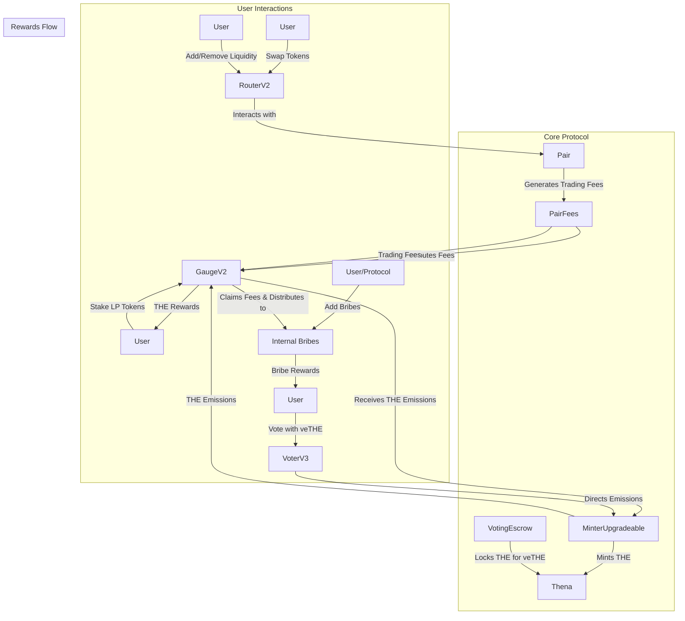

```mermaid
graph TD
    subgraph "User Interactions"
        User_Swap[User] -- Swap Tokens --> RouterV2;
        User_LP[User] -- Add/Remove Liquidity --> RouterV2;
        User_Stake[User] -- Stake LP Tokens --> GaugeV2;
        User_Vote[User] -- Vote with veTHE --> VoterV3;
        User_Bribe[User/Protocol] -- Add Bribes --> Bribes;
    end

    subgraph "Core Protocol"
        RouterV2 -- Interacts with --> Pair;
        Pair -- Generates Trading Fees --> PairFees;
        PairFees -- Distributes Fees --> GaugeV2;
        GaugeV2 -- Receives THE Emissions --> MinterUpgradeable;
        VoterV3 -- Directs Emissions --> MinterUpgradeable;
        MinterUpgradeable -- Mints THE --> Thena;
        VotingEscrow -- Locks THE for veTHE --> Thena;
    end

    subgraph "Rewards Flow"
        PairFees -- Trading Fees --> GaugeV2;
        GaugeV2 -- Claims Fees & Distributes to --> Bribes[Internal Bribes];
        Bribes -- Bribe Rewards --> User_Vote;
        MinterUpgradeable -- THE Emissions --> GaugeV2;
        GaugeV2 -- THE Rewards --> User_Stake;
    end
```
