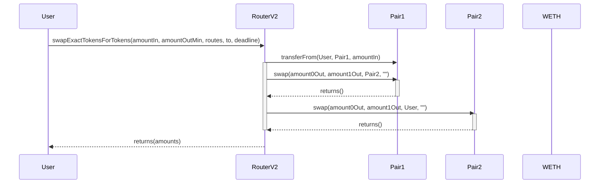

```mermaid
sequenceDiagram
    participant User
    participant RouterV2
    participant Pair1
    participant Pair2
    participant WETH

    User->>RouterV2: swapExactTokensForTokens(amountIn, amountOutMin, routes, to, deadline)
    RouterV2->>Pair1: transferFrom(User, Pair1, amountIn)
    activate RouterV2
    RouterV2->>Pair1: swap(amount0Out, amount1Out, Pair2, "")
    activate Pair1
    Pair1-->>RouterV2: returns()
    deactivate Pair1
    RouterV2->>Pair2: swap(amount0Out, amount1Out, User, "")
    activate Pair2
    Pair2-->>RouterV2: returns()
    deactivate Pair2
    deactivate RouterV2
    RouterV2-->>User: returns(amounts)
```
